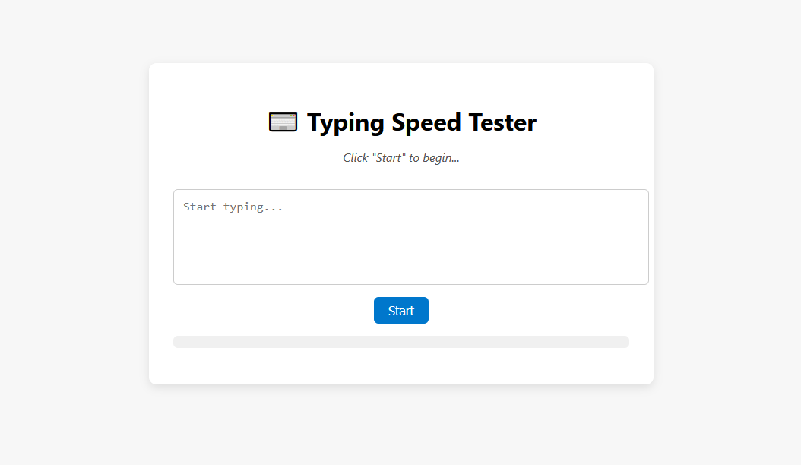

# ⌨️ Typing Speed Tester with Live WPM & Accuracy

A simple and interactive typing speed tester built with HTML, CSS, and JavaScript. It displays a random sentence for you to type, then tracks your **Words Per Minute (WPM)**, **elapsed time**, and **typing accuracy (%)** in real-time!

---

## Table of Contents

- [⌨️ Typing Speed Tester with Live WPM \& Accuracy](#️-typing-speed-tester-with-live-wpm--accuracy)
  - [Table of Contents](#table-of-contents)
  - [Features](#features)
  - [Preview](#preview)
  - [File Structure](#file-structure)
  - [Live Demo](#live-demo)
  - [Installation](#installation)
  - [Usage](#usage)
  - [Contributing](#contributing)
  - [Contact](#contact)
  - [License](#license)

---

## Features

- ✨ Random sentence generation
- 📊 Real-time WPM and time tracking
- 🎯 Live typing **accuracy** feedback
- ✅ Final result summary when you finish typing
- 📱 Mobile-friendly and responsive design
- 💡 No dependencies — built with plain JavaScript!

---

## Preview



---

## File Structure

- `index.html`: The main HTML file that includes the JavaScript and CSS files.
- `style.css`: The CSS file that styles the page.
- `script.js`: The JavaScript file that contains the logic for the typing speed tester.

---

## Live Demo

-[Live Demo](https://codewithoyem.github.io/typing-speed-tester-100daysofcode/).

---

## Installation

1. **Clone the repo**  

   ```bash
   git clone https://github.com/codewithoyem/typing-speed-tester-100daysofcode.git
   cd digital-clock-dark-mode
   ```

## Usage

1. Clone this repository or download the files.
2. Open the `index.html` file in your web browser.
3. Enjoy the typing speed test!

---

This project provides a simple and easy-to-use typing speed tester with real-time WPM and time tracking. It also includes live typing accuracy feedback and a final result summary when you finish typing. The project is built with plain JavaScript and is mobile-friendly and responsive.

Feel free to customize and modify the project to suit your needs. Enjoy the typing speed test!

---

## Contributing

Feel free to contribute to this project by submitting issues or pull requests.

---

## Contact

If you have any questions or need further assistance, please contact me at [oyem@crisent.com](mailto:oyem@crisent.com).

---

## License

This project is created by [Oluwayemi](https://github.com/codewithoyem) and is available for use under the [MIT License](https://opensource.org/licenses/MIT).

---
